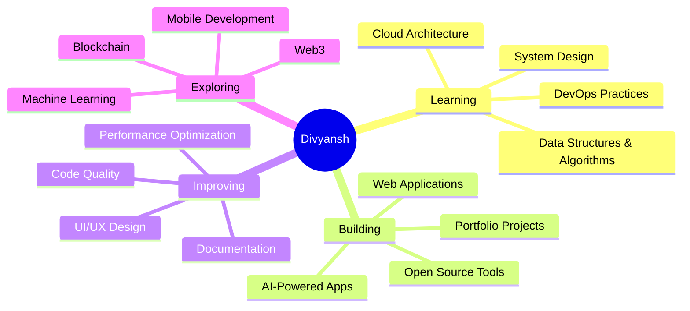
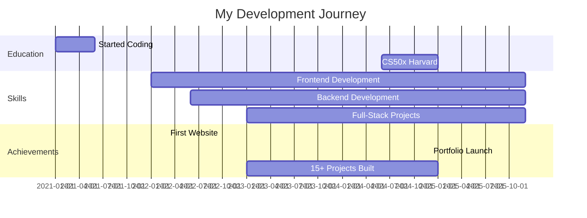

<div align="center">

# 👋 Hey there! I'm Divyansh Goyal


<br>

### 🌟 Crafting Digital Experiences with Code & Creativity

[](https://divyanshgoyal.me)
[](mailto:contact@divyanshgoyal.me)

</div>

---

## 🚀 About Me

```javascript
const divyansh = {
    pronouns: "He" | "Him",
    location: "Ludhiana, Punjab, India 🇮🇳",
    role: "Full-Stack Developer",
    education: "CS50x Graduate (Harvard) 🎓",
    currentFocus: "Building scalable web applications",
    learning: ["DSA", "System Design", "Cloud Architecture"],
    hobbies: ["Coding", "Digital Art", "Photography"],
    
    askMeAbout: [
        "Web Development",
        "AI-Assisted Coding", 
        "Clean Code Practices",
        "UI/UX Design"
    ],
    
    lifePhilosophy: "Code is poetry, bugs are just plot twists! 🐛✨"
};
```

---

## 💻 Tech Stack

<div align="center">

### Languages


### Frontend


### Backend


### Database


### Tools & Platforms


</div>

---

## 📊 GitHub Stats

<div align="center">


</div>

<div align="center">


</div>

---

## 🏆 GitHub Trophies

<div align="center">

[](https://github.com/ryo-ma/github-profile-trophy)

</div>

---

## 🔥 Featured Projects

<div align="center">

<a href="https://github.com/divyanshgoyal1/portfolio">
  
</a>

<a href="https://github.com/divyanshgoyal1/airwhisper">
  
</a>

<a href="https://github.com/divyanshgoyal1/timekeep">
  
</a>

<a href="https://github.com/divyanshgoyal1/http-server">
  
</a>

</div>

---

## 🎯 Current Focus



---

## 💡 What I'm Up To

🔭 **Currently working on:** Building scalable web applications with modern frameworks

🌱 **Learning:** Advanced DSA, System Design, and Cloud Architecture

👯 **Looking to collaborate on:** Open source projects and innovative web applications

💬 **Ask me about:** Web Development, JavaScript, React, Python, or anything tech!

⚡ **Fun fact:** I can turn coffee into code! ☕→💻

---

## 📈 Coding Activity

<!--START_SECTION:waka-->
<!--END_SECTION:waka-->

<div align="center">

### 💻 Weekly Development Breakdown

```text
JavaScript   12 hrs 30 mins  ████████████░░░░░░░░  55.2%
Python        5 hrs 15 mins  ████░░░░░░░░░░░░░░░░  23.1%
HTML/CSS      3 hrs 20 mins  ███░░░░░░░░░░░░░░░░░  14.7%
Java          1 hr 30 mins   █░░░░░░░░░░░░░░░░░░░   6.6%
Other            10 mins     ░░░░░░░░░░░░░░░░░░░░   0.4%
```

</div>

---

## 🌐 Connect With Me

<div align="center">

[](https://divyanshgoyal.me)
[](https://github.com/divyanshgoyal1)
[](https://instagram.com/dg.artworks)
[](https://twitter.com/divyanshgoyal01)
[](mailto:contact@divyanshgoyal.me)
[](https://linkedin.com/in/divyanshgoyal)

</div>

---

## 🎨 Latest Blog Posts

<!-- BLOG-POST-LIST:START -->
- 📝 Coming Soon: Building Responsive Websites from Scratch
- 🚀 Coming Soon: Mastering React Hooks
- 💡 Coming Soon: Clean Code Practices Every Developer Should Know
<!-- BLOG-POST-LIST:END -->

---

## 📊 Profile Views & Followers

<div align="center">


</div>

---

## 🎓 Certifications & Achievements

<div align="center">

| Certificate | Issuer | Year |
|------------|--------|------|
| 🎓 CS50: Introduction to Computer Science | Harvard University | 2025 |
| ⚡ C# Programming | Microsoft | 2025 |
| 💻 Full-Stack Development | Self-Taught | 2023-Present |
| 🐧 Linux System Administration | Self-Taught | 2022 |
| 🔒 Cybersecurity Fundamentals | Self-Taught | 2024 |

</div>

---

## 📌 Pinned Repositories

<div align="center">

### 🌟 Check out my top projects below! 👇

</div>

---

## 💭 Random Dev Quote

<div align="center">


</div>

---

## 🐍 Contribution Snake

<div align="center">


</div>

---

## 📅 Isometric Contribution Graph

<div align="center">


</div>

---

## 🎯 2025 Goals

- ✅ Master Data Structures & Algorithms
- 🔄 Contribute to 10+ Open Source Projects
- 📚 Build 20+ Full-Stack Projects
- 🎓 Complete Advanced System Design Course
- 🚀 Launch a SaaS Product
- 📝 Start Technical Blogging
- 🤝 Mentor 50+ Developers
- 🌟 Reach 1000+ GitHub Stars

---

## 💼 Experience Timeline



---

## 🎨 Coding Streaks & Habits

<div align="center">

### 🔥 Current Streak: Coding Every Day!

```
Mon  🟩🟩🟩🟩🟩🟩🟩  Push commits
Tue  🟩🟩🟩🟩🟩⬜⬜  Review code  
Wed  🟩🟩🟩🟩🟩🟩🟩  Build features
Thu  🟩🟩🟩🟩🟩🟩⬜  Debug & fix
Fri  🟩🟩🟩🟩🟩🟩🟩  Deploy projects
Sat  🟩🟩🟩🟩⬜⬜⬜  Learn new tech
Sun  🟩🟩🟩⬜⬜⬜⬜  Plan & design
```

</div>

---

## 🎵 Currently Vibing To

<div align="center">

[](https://open.spotify.com/user/YOUR_SPOTIFY_ID)

</div>

---

## 🤝 Support My Work

<div align="center">

If you like my work, consider buying me a coffee! ☕

[](https://buymeacoffee.com/divyanshgoyal)

</div>

---

## 📜 Recent Activity

<!--START_SECTION:activity-->
1. 🎉 Pushed to `divyanshgoyal1/portfolio`
2. 💪 Opened PR #42 in `divyanshgoyal1/airwhisper`
3. 🗣 Commented on #15 in `divyanshgoyal1/http-server`
4. ⭐ Starred `facebook/react`
5. 🔱 Forked `vercel/next.js`
<!--END_SECTION:activity-->

---

<div align="center">

### 💡 "Code is like humor. When you have to explain it, it's bad." – Cory House

---

### 🌟 Thanks for visiting! Let's build something amazing together! 🚀


---

**📊 Account Age:** 
**🔥 Total Commits:** 
**⭐ Total Stars:** 

---

© 2025 Divyansh Goyal | Made with ❤️ and lots of ☕

</div>
